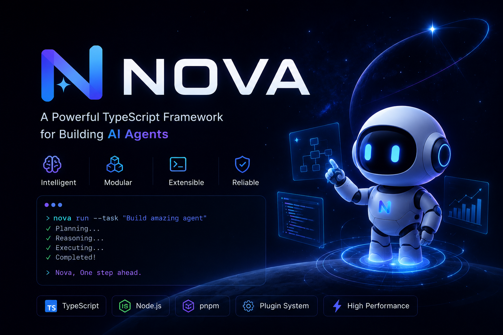

<p align="center">
  
</p>
<p align="center">
  <a href="https://www.npmjs.com/package/@dongzijie1/nova"></a>
  <a href="https://github.com/DongZiJie1/pi-mutant/blob/main/LICENSE"></a>
</p>

<p align="center">
  <a href="./README.md">English</a>
</p>

# Nova - AI 编程智能体

Nova 是一个开源的 AI 编程智能体，支持多种 LLM 提供商（OpenAI、Anthropic、Google、DeepSeek 等），提供交互式终端界面，内置代码读写、执行、搜索等工具。

## 安装

```bash
npm install -g @dongzijie1/nova
```

## 使用

```bash
# 交互模式
nova

# 非交互模式（处理完退出）
nova -p "列出当前目录所有 .ts 文件"

# 使用指定模型
nova --model openai/gpt-4o "帮我重构这段代码"

# 继续上次会话
nova --continue

# 使用指定 thinking 级别
nova --thinking high "解决这个复杂问题"
```

## 核心功能

- **多模型支持** — OpenAI、Anthropic、Google Gemini、DeepSeek、Groq 等
- **内置工具** — 文件读写、代码编辑、Bash 执行、内容搜索
- **会话管理** — 自动保存会话，支持恢复和 fork
- **扩展系统** — 通过 TypeScript 扩展自定义工具和行为
- **RPC 模式** — 支持 JSON-RPC 协议，可对接 Web 前端
- **主题系统** — 支持自定义终端主题

## 项目结构

```
packages/
  ai/              - 统一 LLM API，支持多提供商
  agent/           - Agent 核心，工具调用与状态管理
  nova/            - 主 CLI 应用（即 nova 命令）
  tui/             - 终端 UI 库，支持差分渲染
  server/          - 多实例服务器
  evals/           - LLM 质量评估套件
  storage/
    sqlite-node/   - 基于 SQLite 的会话存储
```

## 开发

```bash
# 安装依赖（跳过生命周期脚本）
npm install --ignore-scripts

# 构建所有包
npm run build

# 代码检查 + 格式化 + 类型检查
npm run check

# 运行测试
./test.sh

# 从源码运行
./pi-test.sh
```

## 开发路线

- [ ] 多 Agent 编排 — 支持主 Agent 生成子 Agent，独立上下文和工具集，并行执行任务
- [ ] 可视化 Web 界面 — 基于 RPC 模式的现代化 Web UI，支持对话、代码 diff 展示和会话管理
- [ ] 网络搜索工具 — 编程过程中实时获取最新信息
- [ ] 更多内置工具 — HTTP 请求、Git 增强、数据处理等

## 致谢

Nova 基于 [Pi Agent](https://github.com/earendil-works/pi)（Earendil Works）fork 而来，感谢原作者构建了优秀的编程智能体框架。

## 许可证

MIT
